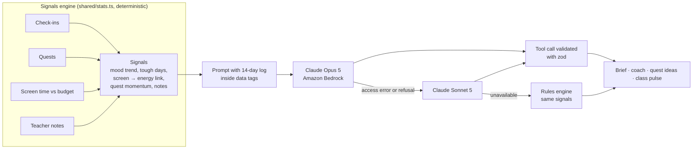
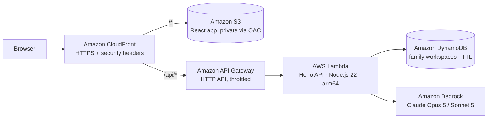

# Anchor

**The family co-pilot for Gen Alpha: one shared plan for the kid in the middle.**

Anchor connects the three people who shape a Gen Alpha kid’s week. Kids check in and run quests, parents get an AI weekly brief grounded in real signals, and teachers close the loop from school. Nobody has to guess, and nobody has to spy.

- **Live demo:** _added after deployment_ (no sign-up: every visitor gets a private demo family with two weeks of fictional data)
- **Built for:** AWS Zero to Shipped 2026 · Startups lane · `#commercial-potential` `#startups`
- **Stack:** React · Hono on AWS Lambda · Amazon DynamoDB · Claude on Amazon Bedrock · Amazon CloudFront + S3 · AWS CDK

## What each person sees

| View | What it does |
|---|---|
| **Parent** | An AI **weekly brief** (wins, watch-outs, a pattern Anchor noticed, conversation starters, quests to try next week), a 14-day mood and screen-time chart, the **Ask Anchor** coach, an inbox of kid requests and teacher notes, and the family agreement (screen budget, teacher sharing). |
| **Kid** | A 30-second emoji check-in (mood, energy, tags), quests that earn points and bonus screen minutes, a visible screen-time ring, and the ability to ask for more time or suggest a quest. |
| **Teacher** | A consent-aware **class pulse**, a roster with 7-day mood heat strips (only for families who opt in), and notes home that can carry a task. That task becomes a quest in the family’s plan. |

### Two-minute tour

1. Open the demo. The parent view writes Maya’s weekly brief. Notice the pattern: _energy was low the day after 4 of 5 over-budget screen days, vs 1 of 7 other days._
2. Hover the 14-day chart, then ask the coach how to talk about late-night screens.
3. Switch to Theo and approve his request for 20 more minutes.
4. Open the **Kid** view, check in as Maya and finish a quest. The bonus minutes show up in her screen-time ring.
5. Open the **Teacher** view, read the class pulse and send Maya’s family a note with a task. Back in the parent view, it’s now one of Maya’s quests.

## How the AI works



- **Explainable by design.** A deterministic signals engine computes what happened, for example “energy was low the day after 4 of 5 over-budget days”. Claude writes the brief on top of those signals and returns the IDs it relied on, which the UI shows under “Based on”.
- **Claude in Amazon Bedrock.** The API calls `anthropic.claude-opus-5` through the Bedrock endpoint for Claude (`@anthropic-ai/bedrock-sdk`, `AnthropicBedrockMantle`) at low effort. Structured output is a tool call validated with the same zod schema that generated the tool definition.
- **Never goes dark.** If a model is not enabled, times out or declines, Anchor tries `anthropic.claude-sonnet-5`. If that fails too, the rules engine writes the brief from the same signals. The whole chain finishes inside API Gateway’s 30-second limit, and the UI labels which one answered.
- **Safety.** The system prompt grounds every claim in the data, leads with strengths, prefers connection over control, treats family- and teacher-written text as data rather than instructions, and points to a pediatrician, counselor or 988 when signals call for it. Kids never chat with the AI; the AI works for the adults.
- **Cost guardrails.** Per-family and global daily AI limits, API Gateway throttling, and 30-day TTL on demo data.

## Architecture on AWS



Everything is defined in [`infra/anchor-stack.ts`](infra/anchor-stack.ts) with the AWS CDK. Each family workspace is a single DynamoDB item, updated with optimistic locking (a `version` condition) so concurrent actions never overwrite each other.

## Privacy and trust

- **Transparency, not surveillance:** kids see the same data their parents see. No message reading, no location, no secret tracking.
- **Consent for school:** teachers only see mood check-ins for families who opt in (a toggle in the parent view). The class pulse only reads shared data.
- **Parent-provisioned profiles:** kids don’t sign up on their own; the product is designed around verifiable parental consent (COPPA) for the production version.
- **Data minimization:** demo workspaces expire after 30 days, and all demo people are fictional.

## Run it locally

Requires Node.js 20.19+ (22 recommended).

```bash
npm install
npm run dev        # API on :8787, web app on http://localhost:5173 (rules-engine AI)
npm test           # unit + API tests
```

To use Claude locally, have AWS credentials with Bedrock access in your environment and run `AI_PROVIDER=bedrock AWS_REGION=us-east-1 npm run dev`.

## Deploy to AWS

Prerequisites: AWS credentials that can bootstrap and deploy CDK stacks, and access to Claude Opus 5 in Amazon Bedrock (Claude Sonnet 5 is open to all Bedrock accounts and is the automatic fallback).

```bash
npm ci
AWS_REGION=us-east-1 npm run deploy
```

`npm run deploy` type-checks, builds the web app and the Lambda bundle, bootstraps CDK, deploys `AnchorStack`, then runs [`scripts/smoke.mjs`](scripts/smoke.mjs). The smoke test loads the site, creates a family and asks Claude for a brief, then prints the live URL. Use a different model chain with `BEDROCK_MODELS=anthropic.claude-sonnet-5 npm run deploy`. Remove everything with `npm run destroy`.

## Project layout

```
api/        Hono API: routes, reducer, DynamoDB/memory stores, Claude on Bedrock, insight prompts
shared/     Types, dates, zod action schemas and the signals engine (used by API and web)
web/        React app: landing page, parent, kid and teacher views, SVG charts
infra/      AWS CDK stack
scripts/    Lambda bundler and post-deploy smoke test
test/       Vitest suites for signals, reducer and API
docs/       Hackathon submission write-up
```

## Built with a coding agent

Anchor was built from an empty repository in a single Claude Code session: product reframe, API, UI, tests, infrastructure and deployment. The agent checked its own work with 18 automated tests, a headless-Chromium walkthrough of all three roles at desktop and phone sizes, a local invocation of the bundled Lambda with API Gateway events, `cdk synth`, and a colorblind-safety check of the chart palette. See [`docs/SUBMISSION.md`](docs/SUBMISSION.md) for the full story.

## Roadmap

- Accounts with Amazon Cognito, role-based access and a verifiable parental consent flow
- Screen-time sync from device platforms instead of self-reporting
- School rostering and LMS integrations so teacher tasks flow in automatically
- Briefs in the family’s home language
- A 90-day pilot with three classrooms to measure check-in rates and brief usefulness
